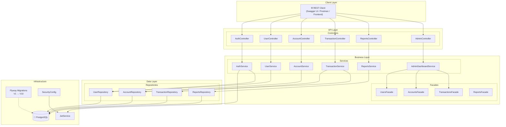
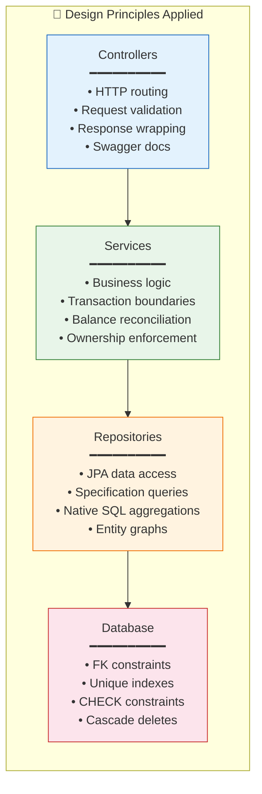
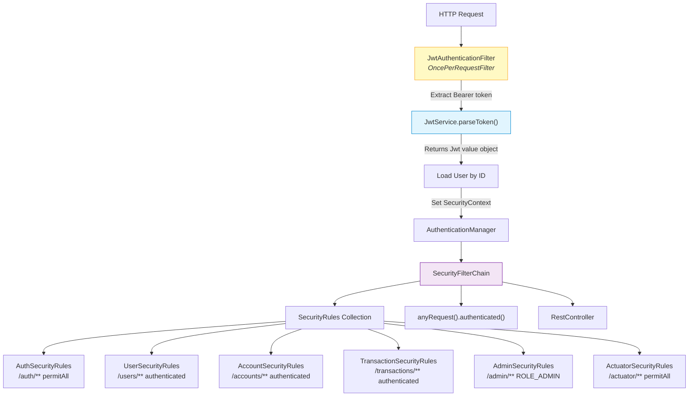
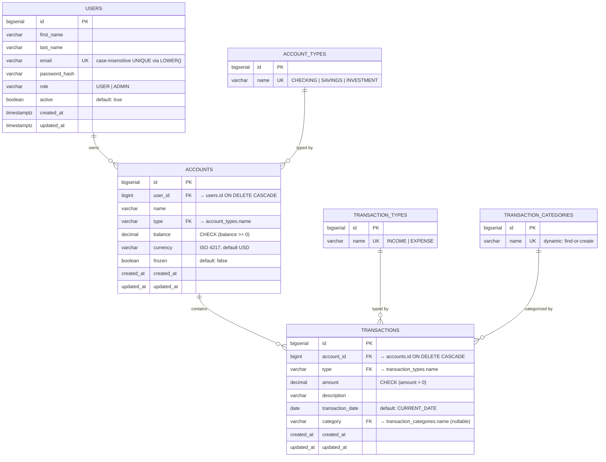
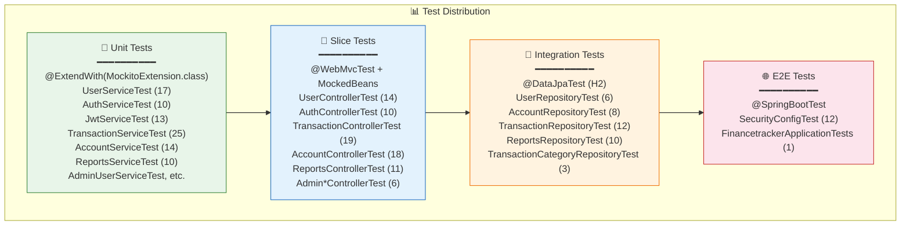
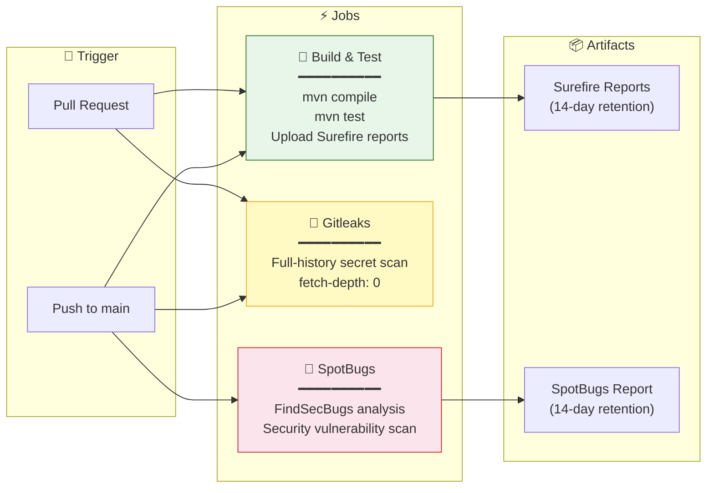

<div align="center">

# 💰 FinanceTracker

### A Production-Grade Personal Finance Management API


RESTful API for tracking personal finances — manage accounts, record transactions, generate financial reports, and administer users with role-based access control.

[](https://github.com/marakicode/financetracker/actions/workflows/ci.yml)

</div>

---

## 📋 Table of Contents

- [Overview](#-overview)
- [Tech Stack](#-tech-stack)
- [Architecture](#-architecture)
- [Package Structure](#-package-structure)
- [Database Design](#-database-design)
- [Security Architecture](#-security-architecture)
- [API Endpoints](#-api-endpoints)
- [Code Quality & Patterns](#-code-quality--patterns)
- [Testing Strategy](#-testing-strategy)
- [CI/CD Pipeline](#-cicd-pipeline)
- [Getting Started](#-getting-started)

---

## 🔍 Overview

FinanceTracker is a **stateless REST API** that enables users to manage their personal finances through multiple bank-like accounts, record income and expense transactions with automatic balance reconciliation, and generate insightful financial reports — all secured with JWT-based authentication and role-based authorization.

### Core Capabilities

| Domain | Description |
|--------|-------------|
| **Authentication** | JWT-based login/register with refresh token rotation via HttpOnly cookies |
| **User Management** | Full CRUD with ownership enforcement, password change, role-based access |
| **Account Management** | Multiple accounts per user (CHECKING, SAVINGS, INVESTMENT) with currency support |
| **Transaction Tracking** | Income/Expense recording with automatic balance updates, category tagging, date filtering |
| **Financial Reports** | Summary, category breakdown, monthly trends, and per-account analytics |
| **Admin Dashboard** | Platform-wide user/account/transaction statistics and management (suspend, freeze, role changes) |

---

## 🛠 Tech Stack

| Layer | Technology | Purpose |
|-------|-----------|---------|
| **Framework** | Spring Boot 3.5 | Application bootstrap, auto-configuration, dependency injection |
| **Language** | Java 17 | LTS version with records, sealed classes, pattern matching |
| **Security** | Spring Security 6.5 | Stateless JWT authentication, method-level security (`@PreAuthorize`) |
| **Persistence** | Spring Data JPA + Hibernate | ORM, entity management, specification-based dynamic queries |
| **Database** | PostgreSQL 16 | Production relational database with JSONB, CTEs, window functions |
| **Migrations** | Flyway | Version-controlled, repeatable database schema evolution |
| **Mapping** | MapStruct 1.6.3 | Compile-time-safe entity ↔ DTO mapping (zero reflection overhead) |
| **Boilerplate** | Lombok | `@RequiredArgsConstructor` injection, `@Getter`/`@Setter`, `@Builder` |
| **Validation** | Jakarta Bean Validation | Declarative request validation via annotations |
| **JWT** | jjwt 0.12.7 | Token generation, parsing, and cryptographic validation |
| **API Docs** | SpringDoc OpenAPI 2.8 | Swagger UI at `/swagger-ui.html`, auto-generated from annotations |
| **Monitoring** | Spring Actuator | Health checks, metrics, and application info endpoints |
| **Testing** | JUnit 5 + Mockito + MockMvc | Unit, integration, and slice tests |
| **Static Analysis** | SpotBugs + FindSecBugs | Automated security vulnerability detection in CI |
| **Build** | Maven | Dependency management, plugin orchestration |

---

## 🏗 Architecture

### High-Level Architecture Diagram



### Layered Responsibility Model



### Modular Security Architecture



> **Key Insight**: Each bounded context provides its own `SecurityRules` implementation. `SecurityConfig` collects all beans and applies them dynamically — no monolithic URL-matching configuration.

---

## 📁 Package Structure

```
com.marakicode.financetracker/
│
├── common/                          # Shared infrastructure
│   ├── ApiResponse.java             # Unified response wrapper: { success, message, data }
│   ├── PagedResponse.java           # Paginated list wrapper: { content, page, size, count, totalPages }
│   ├── BaseEntity.java              # @MappedSuperclass: createdAt, updatedAt with @PrePersist/@PreUpdate
│   ├── ErrorDto.java                # Structured error: { timestamp, status, error, message, path, fieldErrors }
│   ├── GlobalExceptionHandler.java  # @RestControllerAdvice: maps exceptions → HTTP responses
│   ├── SecurityRules.java           # @FunctionalInterface: per-domain security config
│   ├── CurrentUserProvider.java     # Abstraction for extracting authenticated user ID
│   ├── ResourceNotFoundException.java
│   ├── DuplicateResourceException.java
│   ├── ValidationConstants.java     # Shared regex patterns (email, etc.)
│   ├── EmailNormalizer.java         # Case-insensitive email normalization
│   ├── SearchUtils.java             # LIKE wildcard escaping (LIKE injection prevention)
│   ├── OpenApiConfig.java           # Swagger UI configuration
│   └── RequestLoggingFilter.java    # HTTP request/response logging
│
├── auth/                            # Authentication & Authorization
│   ├── SecurityConfig.java          # Security filter chain, CORS, BCrypt, method security
│   ├── Jwt.java                     # Immutable value object wrapping jjwt Claims
│   ├── JwtConfig.java               # @ConfigurationProperties: secret, expiration, SecretKey cache
│   ├── JwtService.java              # Token generation, parsing, validation
│   ├── JwtAuthenticationFilter.java # OncePerRequestFilter: Bearer → SecurityContext
│   ├── UserIdPrincipal.java         # Record: userId + email for @PreAuthorize checks
│   ├── AuthService.java             # Orchestrates login/register/refresh/logout
│   ├── AuthController.java          # POST /login, /register, /refresh, /logout; GET /me
│   ├── AuthSecurityRules.java       # permitAll for /auth/**
│   └── ...                          # DTOs, exceptions, CORS config
│
├── users/                           # User management
│   ├── User.java                    # @Entity: firstName, lastName, email, passwordHash, role, active
│   ├── Role.java                    # Enum: USER, ADMIN
│   ├── UserRepository.java          # JpaRepository<User, Long>
│   ├── UserService.java             # CRUD + password change + ownership enforcement
│   ├── UserController.java          # REST endpoints with @PreAuthorize ownership checks
│   ├── UserMapper.java              # MapStruct: User ↔ UserDto/UserCreateRequest
│   ├── UsersFacade.java             # Interface for cross-domain statistics
│   └── dto/                         # UserDto, UserCreateRequest, UserUpdateRequest, etc.
│
├── accounts/                        # Account management
│   ├── Account.java                 # @Entity: name, type (FK), balance, currency, frozen
│   ├── AccountType.java             # Enum: CHECKING, SAVINGS, INVESTMENT
│   ├── AccountTypeEntity.java       # Reference table entity (3NF)
│   ├── AccountRepository.java       # JpaRepository + Specifications for dynamic filtering
│   ├── AccountService.java          # CRUD + balance initialization + ownership enforcement
│   ├── AccountSpecification.java    # JPA Specifications: nameContains, typeEquals, currencyEquals
│   ├── AccountController.java       # REST endpoints with filtering and pagination
│   ├── AccountsFacade.java          # Interface for cross-domain statistics
│   └── dto/                         # AccountCreateRequest, AccountResponse, etc.
│
├── transactions/                    # Transaction tracking
│   ├── Transaction.java             # @Entity: account (FK), type (FK), amount, category (FK), date
│   ├── TransactionType.java         # Enum: INCOME, EXPENSE
│   ├── TransactionTypeEntity.java   # Reference table entity (3NF)
│   ├── TransactionCategoryEntity.java # Dynamic category entity (find-or-create)
│   ├── TransactionRepository.java   # JpaRepository + Specifications
│   ├── TransactionService.java      # CRUD + balance reconciliation + insufficient funds check
│   ├── TransactionSpecification.java # Dynamic filtering: account, type, category, date range
│   ├── TransactionController.java   # REST endpoints with rich filtering
│   ├── TransactionsFacade.java      # Interface for cross-domain statistics
│   └── dto/                         # TransactionCreateRequest, TransactionResponse, etc.
│
├── reports/                         # Financial reporting (read-only aggregation)
│   ├── ReportsRepository.java       # Native SQL: SUM, COUNT, GROUP BY, CASE, COALESCE
│   ├── ReportsService.java          # Orchestrates queries, maps Object[] → DTOs
│   ├── ReportsController.java       # 4 GET endpoints: summary, category, monthly, account
│   ├── ReportsFacade.java           # Interface for admin dashboard
│   └── dto/                         # SummaryResponse, CategoryBreakdownResponse, etc.
│
├── admin/                           # Admin-only operations
│   ├── AdminUserController.java     # Suspend/activate users, reset passwords, update roles
│   ├── AdminAccountController.java  # Freeze/unfreeze accounts
│   ├── AdminTransactionController.java # View all transactions (read-only)
│   ├── AdminDashboardController.java # Platform-wide statistics
│   └── dto/                         # DashboardResponse, RoleUpdateRequest, etc.
│
└── FinancetrackerApplication.java   # @SpringBootApplication entry point
```

---

## 🗄 Database Design

### Entity-Relationship Diagram



### Migration History

| Version | Description | Purpose |
|---------|-------------|---------|
| **V1** | Create `users` table | Foundation — user accounts with email index |
| **V2** | Case-insensitive email uniqueness | `LOWER(email)` unique index |
| **V3** | Add `role` column, fix email constraint | Role-based access control |
| **V4** | Create `accounts` + `account_types` tables | Financial accounts with FK to users |
| **V5** | Create `transactions` table | Transaction recording with date index |
| **V6** | Add `transaction_types` + `transaction_categories` | 3NF normalization — FK constraints |
| **V7** | FK indexes + trim categories | Performance indexes, data cleanup |
| **V8** | Add `active` column to users | Admin suspend/activate workflow |
| **V9** | Add `frozen` column to accounts | Admin freeze/unfreeze workflow |
| **V10** | Default `transaction_date` | Database-level `CURRENT_DATE` default |

### Design Decisions

- **3NF Reference Tables**: `account_types`, `transaction_types`, `transaction_categories` are separate tables with FK constraints — not just enums in Java code. This enables database-level integrity and future extensibility.
- **Named FK References**: `accounts.type` and `transactions.type` reference `account_types.name` / `transaction_types.name` (not `id`) — keeps queries readable without additional JOINs.
- **Cascade Deletes**: Account deletion cascades to transactions; user deletion cascades to accounts.
- **Immutable Audit Trail**: `created_at` is non-updatable; `updated_at` auto-refreshes via `@PreUpdate`.

---

## 🔒 Security Architecture

### JWT Authentication Flow

```mermaid
sequenceDiagram
    participant C as Client
    participant AC as AuthController
    participant AS as AuthService
    participant JS as JwtService
    participant DB as Database
    participant SEC as SecurityContext

    Note over C,SEC: ──── Login Flow ────
    C->>AC: POST /api/v1/auth/login<br/>{email, password}
    AC->>AS: login(request, response)
    AS->>DB: Authenticate (email + BCrypt)
    AS->>JS: generateAccessToken(user)
    JS-->>AS: Jwt (access, 15min)
    AS->>JS: generateRefreshToken(user)
    JS-->>AS: Jwt (refresh, 7days)
    AS->>AS: Set refreshToken cookie (HttpOnly, SameSite=Lax)
    AS-->>AC: JwtResponse {accessToken}
    AC-->>C: 200 {success, message, data: {accessToken}}

    Note over C,SEC: ──── Authenticated Request ────
    C->>AC: GET /api/v1/transactions<br/>Authorization: Bearer &lt;token&gt;
    AC->>SEC: JwtAuthenticationFilter
    SEC->>JS: parseToken(token)
    JS-->>SEC: Jwt {userId, email, role, type}
    SEC->>DB: Load User by ID
    SEC->>SEC: Set SecurityContext (UserIdPrincipal)
    SEC->>AC: Proceed to controller
    AC->>AC: @PreAuthorize ownership check
    AC-->>C: 200 {success, data: [...]}
```

### Security Controls

| Control | Implementation |
|---------|---------------|
| **Stateless Sessions** | `SessionCreationPolicy.STATELESS` — no server-side session |
| **Password Hashing** | BCrypt via `PasswordEncoder` bean |
| **JWT Access Tokens** | 15-minute expiration, carry `userId`, `email`, `role`, `type` claims |
| **JWT Refresh Tokens** | 7-day expiration, stored as HttpOnly cookie with `SameSite=Lax` |
| **Token Type Discrimination** | `type` claim (`"access"` / `"refresh"`) prevents access tokens from being used as refresh tokens |
| **Ownership Enforcement** | `@PreAuthorize("#id == authentication.principal.id()")` via `UserIdPrincipal` record |
| **Role-Based Access** | `@PreAuthorize("hasRole('ADMIN')")` on admin endpoints |
| **Modular Security Rules** | Each domain provides `SecurityRules` bean — `SecurityConfig` collects and applies them |
| **Secret Key Protection** | `@ToString.Exclude` on `JwtConfig.secret`, thread-safe `SecretKey` cache with double-checked locking |
| **CORS** | Externalized via `CorsProperties`, uses `allowedOriginPatterns` for Spring 6+ credentials compatibility |
| **Input Validation** | Jakarta Bean Validation on all DTOs + custom `@Pattern` email regex |
| **LIKE Injection Prevention** | `SearchUtils.escapeLike()` escapes wildcard characters before SQL LIKE |

---

## 📡 API Endpoints

### Authentication (`/api/v1/auth`)

| Method | Endpoint | Auth | Description |
|--------|----------|------|-------------|
| `POST` | `/login` | `permitAll` | Authenticate with email + password → JWT access token + refresh cookie |
| `POST` | `/register` | `permitAll` | Create account → user data + refresh cookie |
| `POST` | `/refresh` | `permitAll` | Exchange refresh token cookie for new access token |
| `GET` | `/me` | `authenticated` | Get current user profile |
| `POST` | `/logout` | `authenticated` | Clear refresh token cookie |

### Users (`/api/v1/users`)

| Method | Endpoint | Auth | Description |
|--------|----------|------|-------------|
| `POST` | `/` | `ADMIN` | Create a new user |
| `GET` | `/` | `ADMIN` | List all users (paginated) |
| `GET` | `/{id}` | `ADMIN or owner` | Get user by ID |
| `PATCH` | `/{id}` | `ADMIN or owner` | Update user (first/last name) |
| `DELETE` | `/{id}` | `ADMIN or owner` | Delete user (returns 204) |
| `PATCH` | `/{id}/change-password` | `ADMIN or owner` | Change password (requires current password) |

### Accounts (`/api/v1/accounts`)

| Method | Endpoint | Auth | Description |
|--------|----------|------|-------------|
| `POST` | `/` | `authenticated` | Create account (CHECKING/SAVINGS/INVESTMENT) |
| `GET` | `/mine` | `authenticated` | List my accounts (filterable by name, type, currency) |
| `GET` | `/{id}` | `ADMIN` | Get account by ID |
| `GET` | `/` | `ADMIN` | List all accounts (paginated, filterable) |
| `PATCH` | `/{id}` | `ADMIN` | Update account currency |
| `PATCH` | `/{id}/type` | `ADMIN` | Update account type |
| `DELETE` | `/{id}` | `ADMIN` | Delete account (returns 204, cascades transactions) |

### Transactions (`/api/v1/transactions`)

| Method | Endpoint | Auth | Description |
|--------|----------|------|-------------|
| `POST` | `/` | `authenticated` | Create transaction (INCOME/EXPENSE, auto-updates balance) |
| `GET` | `/{id}` | `authenticated` | Get transaction by ID |
| `GET` | `/` | `authenticated` | List transactions (filterable: account, type, category, search, date range) |
| `PATCH` | `/{id}` | `authenticated` | Update transaction (partial, re-reconciles balance if type/amount changed) |
| `DELETE` | `/{id}` | `authenticated` | Delete transaction (reverses balance effect) |

### Reports (`/api/v1/reports`)

| Method | Endpoint | Auth | Description |
|--------|----------|------|-------------|
| `GET` | `/summary` | `authenticated` | Income/expense summary with optional date range |
| `GET` | `/by-category` | `authenticated` | Spending breakdown by category with percentages |
| `GET` | `/monthly` | `authenticated` | Month-by-month income vs expense for a year |
| `GET` | `/by-account` | `authenticated` | Per-account income/expense breakdown |

### Admin (`/api/v1/admin`)

| Method | Endpoint | Auth | Description |
|--------|----------|------|-------------|
| `GET` | `/dashboard` | `ADMIN` | Platform-wide statistics (users, accounts, transactions) |
| `GET` | `/users` | `ADMIN` | List all users with search |
| `GET` | `/users/{id}` | `ADMIN` | Get any user by ID |
| `PATCH` | `/users/{id}/suspend` | `ADMIN` | Suspend user account |
| `PATCH` | `/users/{id}/activate` | `ADMIN` | Activate suspended user |
| `PATCH` | `/users/{id}/role` | `ADMIN` | Change user role |
| `POST` | `/users/{id}/reset-password` | `ADMIN` | Reset to random password |
| `GET` | `/accounts` | `ADMIN` | List all accounts with search |
| `GET` | `/accounts/{id}` | `ADMIN` | Get any account by ID |
| `PATCH` | `/accounts/{id}/freeze` | `ADMIN` | Freeze account (blocks transactions) |
| `PATCH` | `/accounts/{id}/unfreeze` | `ADMIN` | Unfreeze account |
| `GET` | `/transactions` | `ADMIN` | List all transactions with search |
| `GET` | `/transactions/{id}` | `ADMIN` | Get any transaction by ID |

---

## ✨ Code Quality & Patterns

### Design Patterns Applied

| Pattern | Where | Why |
|---------|-------|-----|
| **CQRS** | Services split into commands (write) and queries (read) via `@Transactional` vs `@Transactional(readOnly=true)` | Clear separation of read/write concerns |
| **Facade** | `UsersFacade`, `AccountsFacade`, `TransactionsFacade`, `ReportsFacade` | Decouple admin domain from user domain internals |
| **Specification** | `AccountSpecification`, `TransactionSpecification` | Dynamic query composition without query explosion |
| **Strategy** | `SecurityRules` functional interface — each domain provides its own | Modular, pluggable security configuration |
| **Value Object** | `Jwt` — immutable, wraps `Claims` + `SecretKey`, provides domain methods | Encapsulates JWT complexity behind a clean API |
| **DTO Mapping** | MapStruct with `@Named` methods and nested `@Mapping` | Zero-reflection, compile-time-safe entity ↔ DTO conversion |
| **Wrapper** | `ApiResponse<T>`, `PagedResponse<T>` | Consistent API response structure across all endpoints |
| **Exception Hierarchy** | `ResourceNotFoundException`, `DuplicateResourceException`, `InsufficientFundsException`, `AccountFrozenException` | Typed exceptions → precise HTTP status codes |
| **Lazy Entity Graphs** | `@NamedEntityGraph("Transaction.withAccount")` | N+1 query prevention with explicit fetch plans |

### SOLID Principles

| Principle | Evidence |
|-----------|----------|
| **S — Single Responsibility** | Each service handles one domain; each controller handles one resource; each exception maps to one HTTP status |
| **O — Open/Closed** | `SecurityRules` interface allows new domains without modifying `SecurityConfig`; `Specification` pattern allows new filters without modifying repositories |
| **L — Liskov Substitution** | `Jwt` wraps any `Claims` implementation; `SecurityRules` implementations are interchangeable |
| **I — Interface Segregation** | `SecurityRules` is a single-method functional interface; `UsersFacade`/`AccountsFacade` expose only statistics methods |
| **D — Dependency Inversion** | Services depend on repository interfaces (JpaRepository); controllers depend on service abstractions; `CurrentUserProvider` abstracts auth extraction |

---

## 🧪 Testing Strategy

### Test Pyramid



### Testing Conventions

| Convention | Detail |
|------------|--------|
| **Mock Framework** | Mockito with `@MockitoBean` (Spring Boot 3.4+) — never `@MockBean` |
| **Strict Mode** | Per-stub `lenient()` on `@BeforeEach` stubs only — class-level strict mode disabled |
| **MockMvc Filter Skipping** | `@AutoConfigureMockMvc(addFilters = false)` to bypass security filters in controller tests |
| **H2 for Repos** | `@DataJpaTest` with H2 in-memory DB — Flyway disabled in test profile |
| **Security Cleanup** | `@AfterEach` clears `SecurityContextHolder` to prevent test pollution |
| **Native Query Tests** | `TransactionCategoryRepositoryTest` uses `@Disabled` for PostgreSQL-specific `ON CONFLICT` tests |

---

## 🔄 CI/CD Pipeline

### GitHub Actions Workflow



### Pipeline Behavior

| Event | Build & Test | Gitleaks | SpotBugs |
|-------|:------------:|:--------:|:--------:|
| **PR to main** | ✅ | ✅ | ❌ |
| **Push to main** | ✅ | ✅ | ✅ |

### Local Git Hooks

| Hook | What it does | Bypass |
|------|-------------|--------|
| `pre-commit` | Gitleaks secret scan + `mvn compile` + `mvn test` | `git commit --no-verify` |
| `pre-push` | `mvn compile` + `mvn test` | `git push --no-verify` |

---

## 🚀 Getting Started

### Prerequisites

- **Java 17** (`sdk use java 17.0.8-tem`)
- **Maven 3.9+**
- **PostgreSQL 16** (or use Docker)
- **Gitleaks** (for git hooks)

### Quick Start

```bash
# 1. Activate Java version
source ~/.sdkman/bin/sdkman-init.sh && sdk env

# 2. Create database
createdb financetracker

# 3. Run migrations + start app
mvn spring-boot:run

# 4. Access Swagger UI
open http://localhost:8080/swagger-ui.html

# 5. Run tests
mvn test
```

### Environment Variables

| Variable | Description | Default |
|----------|-------------|---------|
| `SPRING_PROFILES_ACTIVE` | Environment profile (`dev`, `stag`, `prod`) | `dev` |
| `SPRING_DATASOURCE_URL` | PostgreSQL connection URL | `jdbc:postgresql://localhost:5432/financetracker` |
| `SPRING_DATASOURCE_USERNAME` | Database username | `postgres` |
| `SPRING_DATASOURCE_PASSWORD` | Database password | — |
| `SPRING_JWT_SECRET` | JWT signing secret (HMAC-SHA) | — |

---

<div align="center">

**Built with ☕ and clean code principles**

</div>
